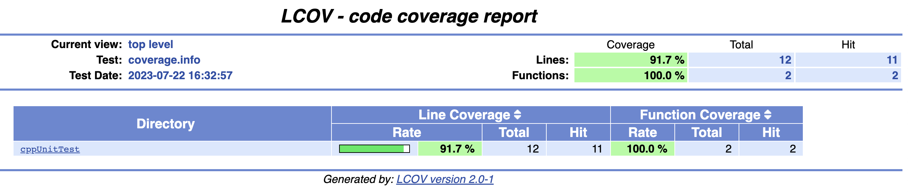
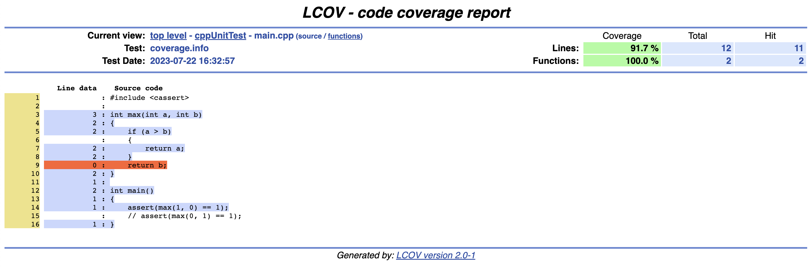

Code Coverage Testing for C++
-----

I’ll proceed in three steps:

1. Command line usage
2. CMake integration
3. Continuous integration

[](https://coveralls.io/github/KhoiVuKha/cppUnitTest?branch=main)

# 1. Command line usage

For command line usage, I’ll use the Gcov code coverage analysis tool. Both GCC and Clang can generate profiling information that can be processed by Gcov.

Let’s start with this simple example of C++ code:

```cpp
#include <cassert>

int max(int a, int b) {
    if (a > b) {
        return a;
    }
    return b;
}

int main() {
    assert(max(1, 0) == 1);
}
```

Compile this with the -coverage flag to tell the compiler to instrument the code:

```bash
g++ -O0 -coverage main.cpp && ./a.out
```

Note that disabling optimizations is required to get reliable coverage results, hence the -O0 flag. After running the test program, you’ll see two additional files being generated:

```bash
$ ls main.*
test.cpp        test.gcda       test.gcno
```

The .gcda and .gcno files contain the coverage data. Now run gcov to process the results:

```bash
$ gcov main.cpp
File 'main.cpp'
Lines executed:87.50% of 8
Creating 'test.cpp.gcov'
```

Nice! This tells us that we already cover 87.5% of our lines of code. Not too bad, but there’s room for improvement.

The resulting test.cpp.gcov file gives a more detailed breakdown which lines have been executed how many times:

```
        -:    0:Source:test.cpp
        -:    0:Graph:test.gcno
        -:    0:Data:test.gcda
        -:    0:Runs:1
        -:    0:Programs:1
        -:    1:#include <cassert>
        -:    2:
        1:    3:int max(int a, int b) {
        1:    4:    if (a > b) {
        1:    5:        return a;
        -:    6:    }
    #####:    7:    return b;
        1:    8:}
        -:    9:
        1:   10:int main() {
        1:   11:    assert(max(1, 0) == 1);
        1:   12:}
```

Not surprisingly, our little test here does not trigger all branches of the max() function. Let’s fix that by adding another assertion:

```cpp
int main() {
    assert(max(1, 0) == 1);
    assert(max(0, 1) == 1);
}
```

This bumps up our line coverage to 100%:

```bash
$ gcov test.cpp
File 'test.cpp'
Lines executed:100.00% of 9
Creating 'test.cpp.gcov'
```

Next, let’s have a look how to visualize this information in a more accessible manner.

***Generate a HTML Report***

Checking code coverage for a simple example like above is easy. However, for a larger project you want something to visualize the coverage information in a more convenient manner. In particular, identifying parts of the code which are not yet covered is important.

This is where lcov comes in: it is a graphical fronted to your coverage data. In particular, you can use it to generate HTML reports. This is done in two steps. First, run lcov in the directory with the coverage information:

```bash
lcov --directory . --capture --output-file coverage.info
```

Then generate the HTML files:

```bash
genhtml --demangle-cpp -o coverage coverage.info
```

Open the resulting coverage/index.html file in a browser of your choice and you’ll see an overview like this:



This allows you to locally browse through your code base and check which parts are covered (light blue) and which not (orange).



Note that I’m showing the version for the lower coverage rate here.


# 2. CMake Integration

For convenience, you can integrate the report generation directly into your build system. Here’s a basic CMakeLists.txt file that adds a custom coverage target to run lcov and genhtml:

```bash
cmake_minimum_required(VERSION 3.6)
project(coverage-example)

if(ENABLE_COVERAGE)
  # set compiler flags
  set(CMAKE_CXX_FLAGS "-O0 -coverage")

  # find required tools
  find_program(LCOV lcov REQUIRED)
  find_program(GENHTML genhtml REQUIRED)

  # add coverage target
  add_custom_target(coverage
    # gather data
    COMMAND ${LCOV} --directory . --capture --output-file coverage.info
    # generate report
    COMMAND ${GENHTML} --demangle-cpp -o coverage coverage.info
    WORKING_DIRECTORY ${CMAKE_BINARY_DIR})
endif()

add_executable(test test.cpp)
```

Create build folder and navigate to this folder:

```bash
mkdir build && cd build
```

Configure and build the project with the ENABLE_COVERAGE option:

```bash
cmake -DENABLE_COVERAGE=true .. && make
```

Now you can run the executable and generate the HTML report:

```bash
./test && make coverage
```

# 3. Continuous Integration

You can take coverage testing one step further and directly integrate it into your continuous integration (CI) pipeline. This is useful for checking how the coverage rate evolves and to make sure it does not decrease as you integrate new features into your project.

In this example, I’m using GitHub Actions for integration builds and the Coveralls web service to visualize results.

Here is an example for a GitHub workflow that builds and runs the example project from above and uploads the coverage results to Coveralls:

Notes: You need to setup Coveralls accounts (or just log in with github account) and provide access to the testing repository. See Coveralls [Getting started](https://docs.coveralls.io/)

```bash
name: coverage
on: push
env:
  BUILD_TYPE: Debug
jobs:
  coverage:
    runs-on: ubuntu-latest

    steps:
      - uses: actions/checkout@v2

      - name: Install dependencies
        if: runner.os == 'Linux'
        run: sudo apt-get install -o Acquire::Retries=3 lcov

      - name: Create build directory
        run: cmake -E make_directory ${{runner.workspace}}/build

      - name: Configure CMake
        shell: bash
        working-directory: ${{runner.workspace}}/build
        run: cmake $GITHUB_WORKSPACE -DCMAKE_BUILD_TYPE=$BUILD -DENABLE_COVERAGE=true

      - name: Build
        working-directory: ${{runner.workspace}}/build
        shell: bash
        run: cmake --build . --config $BUILD_TYPE

      - name: Run
        working-directory: ${{runner.workspace}}/build
        shell: bash
        run: ./test

      - name: Coverage
        working-directory: ${{runner.workspace}}/build
        shell: bash
        run: make coverage

      - name: Coveralls
        uses: coverallsapp/github-action@master
        with:
          path-to-lcov: ${{runner.workspace}}/build/coverage.info
          github-token: ${{ secrets.GITHUB_TOKEN }}
```

If you are curious what the result looks like for a real-world project, check out the Coveralls page for our mesh processing library.


**Bottom Line**

Code coverage testing is a tremendously useful tool that I regularly use during development. When writing new code, it gives me confidence that my tests are doing what I think they do. However, I find it particularly useful when bringing legacy code under test. The coverage information guides me which tests to write until I reach sufficient coverage for that code.

Beware though that using code coverage as a quality metric can be misleading. High coverage is not a goal in itself. It’s a means, not an end. The fact that there is a test triggering your code does not guarantee you anything about wether the test does something meaningful at all.

Give code coverage a try. I bet that once you experience the benefit of having coverage information available you don’t want to miss it form your development toolbox.
